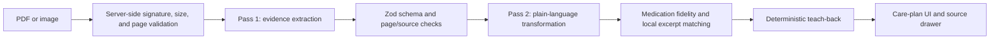

# ClearCare

**Source-first discharge instructions, organized for the moment after care.**

ClearCare turns a dense discharge PDF or image into a prioritized, plain-language care plan without inventing clinical instructions. Every important item stays connected to the page and excerpt that support it; conflicts, missing attachments, and uncertain details remain visible instead of being guessed away.

> ClearCare is an educational hackathon prototype. It organizes and explains source material; it does not diagnose, recommend treatment, change medication instructions, judge an emergency, or replace a healthcare professional.


## Why it matters

Discharge paperwork often mixes medication changes, exact thresholds, labs, appointments, restrictions, warning signs, and background narrative. That is a lot to interpret while tired or supporting someone else. ClearCare makes the instructions easier to review while preserving the original evidence and exposing what still needs confirmation.

## What is complete

- Responsive landing, validated upload, honest progress, reset, and print journey
- Comprehensive four-page fictional PDF and deterministic demo that needs no key or network
- Canonical Zod schema covering the encounter, actions, medications, monitoring, follow-up, services, restrictions, uncertainties, conflicts, glossary, sources, page coverage, and teach-back
- Source-verification drawer with multi-page navigation, exact excerpts, generated sample-page images, and request-scoped previews for uploaded PDFs/images
- Source-linked diagnoses plus complete hospital-stay context, clearly separated from instructions for home
- Print-friendly care plan with evidence page references, hospital context, glossary, and safety statement
- Medication groups for start, change, hold, stop, temporary, continue, resume, and unclear states
- Explicit uncertainty and conflict handling—ClearCare never silently resolves a medical disagreement
- Deterministic teach-back questions scored only in the browser
- Server-only, two-pass OpenAI Responses API path with Structured Outputs, local integrity checks, `store: false`, rate limiting, and an append-only cost ledger
- 56 unit/integration tests, three Playwright journeys, strict type-checking, zero-warning lint, production build, responsive/print screenshots, and generated submission artifacts


## Try the judge path

1. Run the app and select **Try the Comprehensive Sample**.
2. Review the at-a-glance summary and explicit timing groups.
3. Compare the medication action groups, including an unresolved insulin conflict.
4. Open **Change potassium chloride across two pages** and move from page 2 to page 3.
5. Review the exact weight threshold and follow-up instructions.
6. Complete the teach-back; choose one wrong answer first to see the source-grounded correction.
7. Print the care plan, then reset. No sample state is retained.

The sample is synthetic. It is deliberately broad enough to exercise cross-page medication text, missing fields, a missing referenced attachment, exact numbers and units, uncertainty, and a contradiction.

## Architecture at a glance



The deterministic sample enters after validation with a committed, schema-valid fixture, so demonstrations remain reliable without pretending that AI ran. The live endpoint returns an explicit error if live mode or credentials are unavailable; it never falls back silently.

See [Architecture](docs/ARCHITECTURE.md), [AI pipeline](docs/AI_PIPELINE.md), [Safety](docs/SAFETY.md), [Privacy](docs/PRIVACY.md), and the [design system](docs/DESIGN_SYSTEM.md) for the product rationale.

## Stack

- Next.js 16 App Router, React 19, strict TypeScript, Tailwind CSS
- Zod 4 as the canonical application and Structured Outputs schema
- OpenAI JavaScript SDK and Responses API
- PDF.js for best-effort local excerpt matching; pdf-lib for safe PDF validation and reproducible fixture generation
- Vitest, Testing Library, and Playwright

The live implementation follows OpenAI's official guidance for [Structured Outputs](https://developers.openai.com/api/docs/guides/structured-outputs), [PDF inputs](https://developers.openai.com/api/docs/guides/pdf-files), and [API pricing](https://developers.openai.com/api/docs/pricing). Pricing is a dated guardrail snapshot, not a billing promise.

## Local setup

Requirements: Node.js 20 or newer and npm.

macOS or Linux:

```bash
git clone <your-repository-url>
cd clearcare
npm ci
cp .env.example .env.local
npm run dev
```

Windows PowerShell:

```powershell
git clone <your-repository-url>
Set-Location clearcare
npm.cmd ci
Copy-Item .env.example .env.local
npm.cmd run dev
```

Open [http://localhost:3000](http://localhost:3000). The comprehensive sample works immediately with `CLEARCARE_ENABLE_LIVE_API=false` and no API key.

For an explicitly authorized live test, set these only in ignored `.env.local`:

```dotenv
OPENAI_API_KEY=<server-side-secret>
OPENAI_MODEL=gpt-5.6-terra
CLEARCARE_ENABLE_LIVE_API=true
RUN_LIVE_API_TESTS=false
```

The API project needs **Responses Write**. Grant **Files Write** only if the inline `file_data` implementation is changed to use uploaded file IDs, and **List Models Read** only for the documented model-access diagnostic. Use the least-privilege project key available.

Then start the app and upload a supported file, or opt into the synthetic integration test for one command:

```powershell
$env:RUN_LIVE_API_TESTS='true'; npm.cmd run test:live-api
```

The integration script emits only structural counts, token totals, and estimated cost. Do not use real patient data in this prototype.

## File and API boundaries

- Accepted: PDF, PNG, JPG, or JPEG; maximum 10 MiB; PDFs maximum 25 pages
- Extension, declared MIME type, and file signature must agree
- The API key is referenced only from server code
- Requests use `store: false`; the app has no database or user-upload retention path
- Successful results may be cached only when the submitted bytes exactly match the committed fictional sample; the hash-keyed `.clearcare/synthetic-cache/` is ignored and excluded from packages, and user documents or derived care plans are never written there
- Live calls are capped at 15 pipelines, three higher-cost model pipelines, and an estimated $8 soft stop by default
- Input token counts are requested before generation; the ledger contains hashes, counts, model names, outcomes, and cost estimates—not document contents
- No hidden retry loops; refusal, authentication, permission, rate-limit, timeout, schema, token-count, and budget failures are surfaced as safe categories and recorded without raw error text

## Verification

```bash
npm run lint
npm run typecheck
npm test
npm run build
npm run test:e2e
npm run secrets:check
npm run package
```

Tests run with live access forced off. `npm run test:live-api` is the only opt-in integration command. See [Testing](docs/TESTING.md) for the coverage matrix and current exact results.

The submission ZIP is built from a strict allowlist: application source, required configuration, synthetic assets, tests, documentation, judging materials, screenshots, the safe environment template, and license. Internal workflow files and any unrecognized top-level metadata are not packaged.

## Project map

```text
app/                 Next.js routes and server API
components/          Landing, dashboard, source viewer, teach-back
lib/schema/          Canonical Zod contract
lib/ai/              Prompts, guarded two-pass pipeline, pricing ledger
lib/documents/       Validation and local PDF text extraction
lib/mock/            Deterministic sample source and fixture loader
public/samples/      Generated four-page fictional PDF
tests/               Unit, component, and Playwright coverage
docs/                Architecture, safety, privacy, testing, deployment
docs/judging/        Devpost copy, demo scripts, deck, screenshots, judge notes
scripts/             Sample generation, live proof, secret scan, packaging
```

## Deployment

The project is deployment-ready for a Node-capable Next.js host. Configure environment variables in the host's secret manager, keep live analysis off until reviewed, and validate the upload-body and function-duration limits. No public deployment was created as part of this build. Follow [Deployment](docs/DEPLOYMENT.md).

## Privacy and clinical readiness

This prototype is not represented as HIPAA compliant, a medical device, or ready for clinical use. A production path would require privacy and security review, a defined data-processing agreement and retention policy, encryption and access controls, auditability, clinical and human-factors validation, incident response, accessibility testing, and jurisdiction-specific regulatory analysis.

## Credits and license

Built as the ClearCare hackathon project. Add team member names, event name, public demo URL, and repository URL before submission. OpenAI is used for the optional source-grounded live analysis path; all included patient and facility names are fictional.

Released under the [MIT License](LICENSE).
